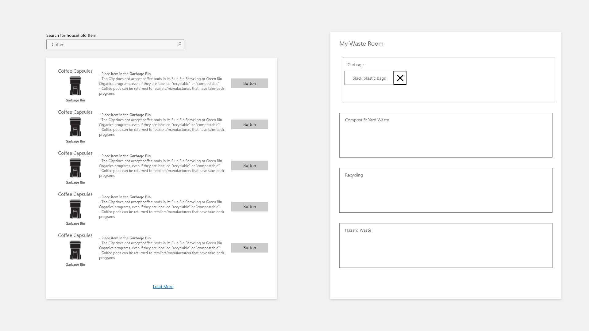

# OutStem Front-end Challenge

Welcome to the OutStem front-end challenge. Submission instructions are listed below. The deadline to submit this challenge is **January 25th, 2021 @ 1:00 AM EST**. We would like to emphasize that we are looking for effort, and that the challenge is just part of our discussion with you during the interview, so don’t worry if your solution is hacky or even if it doesn’t work, we want to see it! 

## Challenge - Frank’s Waste Wizard
Our client Frank (who lives in Toronto) has requested that we help him with waste sorting, he comes from the old times where everything goes into the trash and gets collected three times a week, one day he received a notice from the city that he will be fined if he doesn’t start properly sorting his waste. Confused by the complex waste sorting charts, he turned to us for help - he wants us to create a front-end only web app that makes it easier for him to:

- Search for waste item by keyword, item name, etc.
- Display the proper bin to dispose the trash in
- Display the escaped information that comes with the dataset properly
- Add items to a collection called “waste room”. Remove items from the “waste room”
## Data & Assets
Here is the Toronto waste dataset that is provided by the City of Toronto, it comes in JSON format so it should be able to be directly consumed by your web app.

```
https://secure.toronto.ca/cc_sr_v1/data/swm_waste_wizard_APR?limit=1000
```

We have also included some pictures for the different household waste bins in the [assets](/assets) folder. You will need to find a custom icon for a few additional waste types.

## Screenshot


You should not implement the design 1:1, please add your own understanding to this simple mock up.

## Technical requirements
1. App will be accessible using a browser
2. You can use any framework, library you like
3. Data will come from the dataset mentioned above.
4. Each result will list at least the following information
     - Item name
     - Item description
     - The bin it belongs in and a picture of such bin (URLs to all pictures can be found in the Data & Assets section)
5. There will be at most 5 results displayed at a time for any query, have a load more button that will display the next 5 results
6. The search will happen as the user types
7. Items in the search result can be added to the “waste room”
8. The “add to waste room” button should be disabled if the item is already in the waste room
9. The waste room should have 4 sections, items will be automatically added to their matching section:
     - Regular trash & curbside pickup
     - Recycling
    - Organics & Yard waste
     - Hazardous Waste
10. When an item is in the waste room their name will be displayed.
11. The app will be optimized for mobile devices like smartphones and tablets.

## Frank’s Nice to haves

-	Frank thinks it would be nice to be able to add custom waste items to the data set
-	Frank thinks it would be nice to have an image of the item in the search result as well
-	Frank thinks it would be nice to be able to see the details about the waste item in the waste room when he clicks on it
-	Frank thinks it would be nice if the waste room is saved even if he leaves the page
-	Frank thinks it would be nice to be able to share the waste room with his partner via a link or an image
-	Frank thinks it would be nice to have debouncing for the search box since his computer is not very fast
-	Frank is a visual head and would like to see some slick animations on the app (loading, moving items and removing items)

## Submission
Please submit your solution in the 2021 Summer interview GitHub repository.

### Via Pull Request (Recommended)
Edit the SUBMISSION.md file and pull request your changes. Make sure to include the following information in the file:
-	A link to your hosted application (you can host it for free using GitHub Pages, Netlify, Vercel, or Heroku)
-	A link to your public repository
-	Any additional information you would like us to know about.

### Via GitHub Issue
You can also submit your solution via GitHub Issues, create an issue in the repository with the following information:
-	A link to your hosted application (you can host it for free using GitHub Pages, Netlify, Vercel, or Heroku)
-	A link to your public repository
-	Any additional information you would like us to know about.
